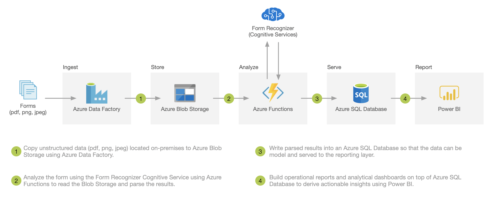

# Form Recognizer DataOps Pipleine
## About
Welcome to the Form Recognizer Solution Accelerator! This accelerator was built to provide developers with all of the resources needed to quickly build an initial form understanding prototype with the Azure Form Recognizer Cognitive Service. Use this accelerator to jump start your development efforts with your own data or as a learning tool to better understand how Form Recognizer can be leveraged for the unique needs of your business.

In this repository, we've provided you with all of the artifacts needed to quickly create a Form Recognizer content management pipeline including: templates for deploying the appropriate Azure resources, assets for creating your first trained Form Recognizer model, a pipeline to help automate the ingestion and storage. This extends the ability to allow you to build your own triggers and supporting workflows to react to errors or specific content that has been extracted. We've opted to use serverless building blocks like Functions and Flow to create the orchestration with easy to follow recipes.

## Architecture

## Technology Scope
* Azure Data Factory
* Azure Blob Storage
* Azure Functions
* Cognitive Services (Form Recognizer)
* Azure SQL Database
* Power BI

## Pre Requisites
1. Request access to the [Form Recognizer](https://aka.ms/FormRecognizerRequestAccess) service.
2. Access to an [Azure Subscription](https://azure.microsoft.com/en-us/free/) with the ability to create services.
3. [Postman](https://www.getpostman.com/) installed on your local machine.

   Note:
   * Form Recognizer access requests are approved in batches, please provide some lead time before proceeding with this exercise.
   * If you don't have access to an Azure subscription, you can create a [free Azure account](https://azure.microsoft.com/en-us/free/) with $200 USD credit to explore any Azure service for 30 days.
   * If you are new to Postman, check out [Part 1: Sending a Request](https://www.youtube.com/watch?v=YKalL1rVDOE) in the New to Postman video series.

## Level
This course is designed as an intermediate level course for AI engineers and/or Cloud Solution Architects.

## Course Modules
* Lab 1 - [Environment Setup](labs/lab-environment-setup.md)
* Lab 2 - [Postman Collection](labs/lab-postman-collection.md)
* Lab 3 - [Azure Functions](labs/lab-azure-functions.md)
* Lab 4 - [Azure Data Factory](#)
* Lab 5 - [Azure SQL Database](#)
* Lab 6 - [Power BI](#)

## Resources - Form Recognizer
* [Access Request](https://aka.ms/FormRecognizerRequestAccess)
* [Product Page](https://aka.ms/form-recognizer)
* [Documentation](https://aka.ms/form-recognizer/docs)
* [API Reference](https://aka.ms/form-recognizer/api)
* [Pricing](https://azure.microsoft.com/en-us/pricing/details/cognitive-services/form-recognizer/)
* [MS Build - [BRK2002] Announcing Form Recognizer](https://mybuild.techcommunity.microsoft.com/sessions/76962?source=sessions)